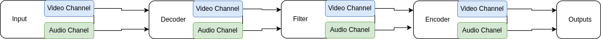

# meblo

Open Media Blocks - A collection of Golang code to create media streaming services the way you need it

The intention of this library is to create a catalog of moudles that can be used to setup customized media
streaming servers example are:

- RTMP stream multiplication to stream one RTMP stream to many servers
- DASH / HLS media streaming
- Creation of VODs with DRM technologies

## Status

- [x] Input first version implemented and tested
- [ ] Output partially implemented needs to be completed and tested
  - only write the header right now but is not writing the packets to the output file yet

## meblo elements



In meblo we can use different types of components to create our media streaming pipeline.

**Inputs** modules will read data from input which can be files like video files or png files, or it can be network
based protocols like RTMP or UDP. Each Input elements will
provide to channels of type \*AVPacket which can be used
by the subsequent pipe elements. The next component in the
pipe must ensure to clean packet memory.

**Decoder** will take the packets from the inputs and
decode them into their raw format. The output of the decoder
will be audio and video channels of type \*AVFrame. The
next element in the pipe needs to ensure to clean frame
memory once frame is not needed any longer

**Filter** will be able to take the AVFrame object and
process them . The output of these modules will be channels
of type \*AVFrame. The next stage is responsible for freeing
memory for AVFrames on the outputs.

**Encoder** from filters it will go into encoder that
will take the raw image and encode them with respective
configurations like resolution and bitrate. The input
of encoder will be channels of *AVFrame where as the output
will be channels of type *AVPacket.

**Outputs** will take the AVPackets from the Encoders and
convert it into the respectice output path. Outputs will
not have any channels as output as the data is directly saved
on disk or send over some network protocol

### Input

Input elemet can be used to read video data from different types of sources.

```golang
type  Input struct {
	base           BaseInput        //the base input
	videoOut       chan *C.AVPacket //video data
	audioOut       chan *C.AVPacket //audio data
	audioTimescale utils.Timescale  //define the audio timescale
	videoTimescale utils.Timescale  //define the video timescale
}

func (in *Input) Open() {} //open the input and start processing
func (in *Input) Close() {} //stop the input and free all resources
func (in *Input) Restart(inStr string) {} //restart input from the beginning (needed for RTMP restart after connection break) use original in string when inStr is set to "" otherwise use the provided string
func (in *Input) GetStats() {} //return the internl statistics of the module

//Example: read a video from a file
fileInput := Input{}
err := fileInput.Open("/home/user/Videos/test.mp4")

//Example: read video from an rtmp server (rtmp pull)
// - reading the video and audio data and restart the rtmp
//   when connection closes
rtmpInput := Input {}
autoRetry := true;
err := rtmpPullInput.Open("rtmp://localhost:1935/live/input", autoRetry)

go func(){
    for {
        for {
			packet := <-fileInput.videoOut
            // Do something with the packet here

            //free the packet memory
            FreePacket(packet)
        }
    }
}()

```
